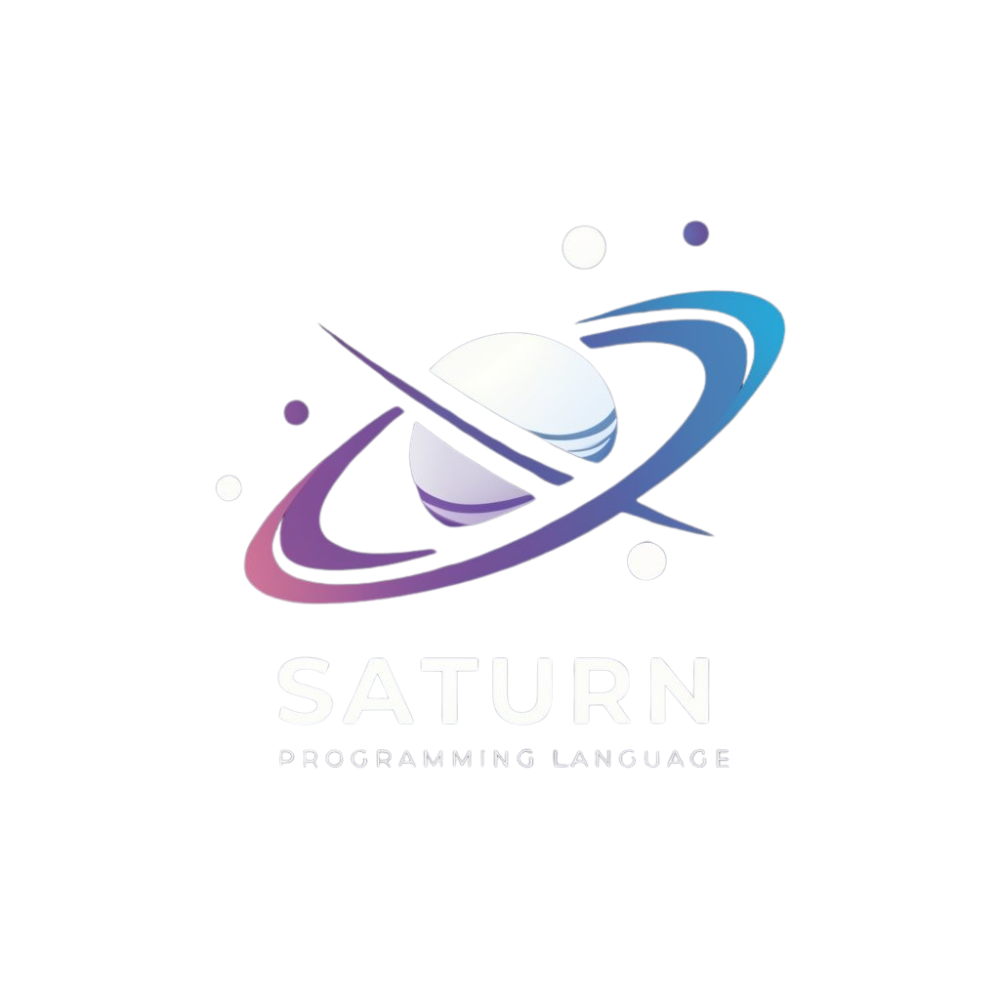

<div align="center">

</div>
 
<h1>Saturn Programming Language</h1> 

Saturn is a simple programming language designed for educational purposes. It supports basic control structures, variables, and function definitions.

## Getting Started

To run Saturn programs, you need to have the Saturn interpreter installed on your system. Follow these steps to get started:

1. **Installation**

   Download and install the Saturn interpreter from [GitHub](https://github.com/nm-doyun/saturn-lang).

2. **Running a Saturn Program**

   Execute a Saturn program by providing the filename with the `.srn` extension as an argument to the Saturn interpreter:

```sh
saturn your_program.srn
```

3. **Command-Line Options**

```sh
--author: Print the name of the author or creator of Saturn. (deprecated, is going to be deleted)
```
# Syntax and Features

**Function Definition**

In Saturn, functions are defined using the func keyword followed by the function name and parentheses (). Parameters are not supported at this stage of development.

Example:

```go
func saturn()
    print("Life's better on saturn");
end
```

**Function Body:**

Define the body of the function by placing statements between func functionName() and end.
Indentation is not required in Saturn, but it's recommended for readability.

**Function Invocation:**

Call the function by simply writing its name followed by parentheses () wherever you need to execute its code.

**Main Function**
The main function is the entry point of every Saturn program. Execution starts from the main function, making it mandatory in every Saturn program.

**Example:**

```go
func main()
    print("Hi, saturn!!");
    saturn();
    x = {"Apple", "Orange", "Saturn"};
    print(x);
    great();
end
```

**Conditional Statements**
Saturn supports if statements for conditional execution based on Boolean expressions:

```go
if xd == 0 then
    print("ur mom");
end
```

**Printing**
Use the print() function to output text to the console:

```go
print("Hello, Saturn!");
```

**Data Types**

Strings: Enclosed in double quotes (").

Lists: Enclosed in curly braces {}.

Example: test.srn
```go
func main()
    print("Hi, saturn!!");
    saturn();
    x = {"Apple", "Orange", "Saturn"};
    print(x);
    great();
end

func saturn()
    print("Life's better on saturn");
end

func great()
    xd = 0
    if xd == 0 then
        print("ur mom");
    end
end
```

## Notes:

**Development Stage:** *Saturn is a language under development, and certain features such as function parameters may be added in future versions.*

*This README provides a basic overview to get started with Saturn programming. For detailed syntax and examples, refer to the test.srn file and experiment with the Saturn interpreter.*
